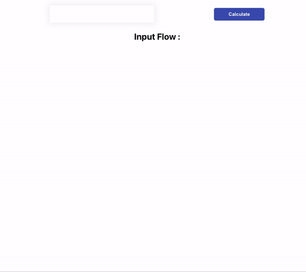

# Assured flow solutions Pipeline flow challenge


## App.js
```js
import logo from "./logo.svg";
import "./App.css";
import { useState } from "react";

function App() {
  // this is the variable for time constant change as you wish
  const TIME_CONST = 22;
  // this is the initial section angle
  // I will increment this by counter * 10 as i calculate the 10 sections
  // to make the angles different
  const INTIAL_SECTION_ANGLE = 15;

  // this is an array used to display results in a list
  // once the calculation is done it initialased to an empty array
  const [sectionFlowResults, setSectionFlowResults] = useState([]);

  // state variable to hold initial section flow
  const [inputFlow, setInputFlow] = useState();

  // seperate method to calucate a section flow
  function calculateSectionFlow(previousFlow, sectionAngle) {
    return (previousFlow * sectionAngle) / TIME_CONST;
  }

  function handleCalculateButtonClick() {
    // initial previous flow value is the one entred in the input.
    let previousFlow = inputFlow;

    let results = [];
    // pushing first section flow into temporary array
    results.push(previousFlow);

    // counter to iterate to 10 initial value set to 2
    // since first section already calucalted
    let counter = 2;
    while (counter <= 10) {
      let sectionFlow = calculateSectionFlow(
        previousFlow,
        INTIAL_SECTION_ANGLE * counter
      );

      // updating previous previous flow variable
      previousFlow = sectionFlow;
      results.push(Math.round(sectionFlow));
      counter++;
    }

    // setting the state variable for section flow to new value after calculation
    setSectionFlowResults(results);
  }
  return (
    <div className="container">
      <div className="row">
        <input
          value={inputFlow}
          onChange={(event) => setInputFlow(event.target.value)}
        />

        <button onClick={handleCalculateButtonClick}>Calculate</button>
      </div>

      <h3 className="inputFlow">Input Flow : {inputFlow}</h3>
      <ul className="results">
        {sectionFlowResults.map((result, index) => (
          <li>
            <div className="resultRow">
              <p>Section {index + 1} Flow: </p>
              <p className="resultValue">{result} °Deg</p>
            </div>
          </li>
        ))}
      </ul>
    </div>
  );
}

export default App;

```

## App.css
```css
.container {
  padding-right: 15px;
  padding-left: 15px;
  margin-right: auto;
  margin-left: auto;
  max-width: 760px;
}

.row {
  display: flex;
  flex-direction: row;
  justify-content: space-around;
  align-items: center;
  padding-top: 20px;
}

.results {
  display: flex;
  flex-direction: column;
  list-style: none;
  padding-left: 20px;
  padding-right: 20px;
}

.resultRow {
  display: flex;
  flex-direction: row;
  justify-content: space-evenly;
  padding: 10px;
  border: 0;
  box-shadow: 0 0 15px 4px rgba(0, 0, 0, 0.06);
  margin-bottom: 5px;
}

input {
  padding: 10px;
  border: 0;
  box-shadow: 0 0 15px 4px rgba(0, 0, 0, 0.06);
  font-size: 1.5rem;
  text-align: center;
  font-weight: bold;
}

button {
  appearance: none;
  -webkit-appearance: none;
  padding: 10px 40px;
  border: none;
  background-color: #3f51b5;
  color: #fff;
  font-weight: 600;
  border-radius: 5px;
  cursor: pointer;
}

.resultRow p {
  font-size: 1.2rem;
  text-align: center;
  font-weight: bold;
  letter-spacing: 2px;
}

.resultRow .resultValue {
  color: #3f51b5;
}

.inputFlow {
  text-align: center;
  font-size: 1.5rem;
}
```

## index.js
```js
import React from 'react';
import ReactDOM from 'react-dom';
import './index.css';
import App from './App';


ReactDOM.render(
  <React.StrictMode>
    <App />
  </React.StrictMode>,
  document.getElementById('root')
);
```

## index.css
```css
body {
  margin: 0;
  font-family: -apple-system, BlinkMacSystemFont, 'Segoe UI', 'Roboto', 'Oxygen',
    'Ubuntu', 'Cantarell', 'Fira Sans', 'Droid Sans', 'Helvetica Neue',
    sans-serif;
  -webkit-font-smoothing: antialiased;
  -moz-osx-font-smoothing: grayscale;
}

code {
  font-family: source-code-pro, Menlo, Monaco, Consolas, 'Courier New',
    monospace;
}

```


## User interface

**Main view**
<p align="center">
 
</p>

<p align="center" size="10px">
This is the main view on the user end.
</p>
